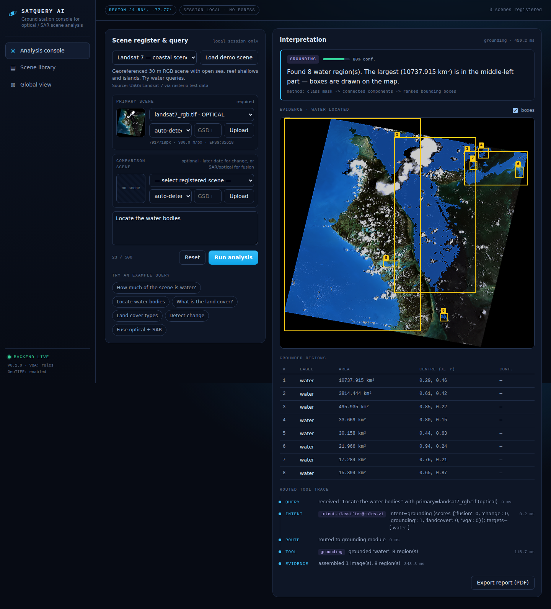
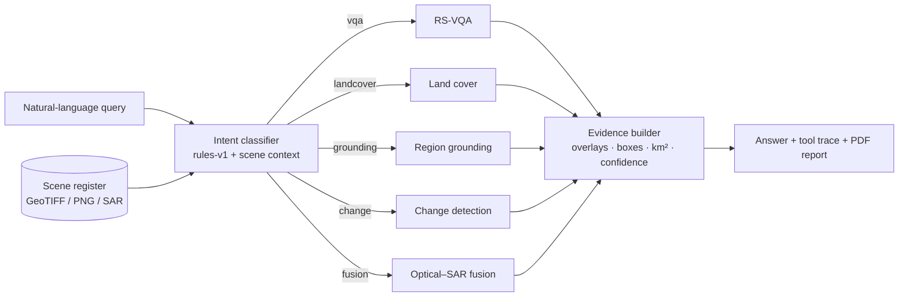

# SatQuery AI

**Agentic vision-language assistant for optical and SAR remote-sensing analysis.**
Ask a question about a satellite scene in plain English. An orchestrator routes it to the right specialist tool and returns an answer backed by evidence: masks, bounding boxes, areas in km², a confidence score and the full tool trace.

> Smart India Hackathon 2026 · Problem Statement **26167** (ISRO / SAC) · Space Technology · **Team Hydra**



---

## Why it's different

| | Typical "chat with an image" demo | SatQuery AI |
|---|---|---|
| Answers | Free text from one big VLM | Numbers measured from pixels (%, km², counts) |
| Evidence | None | Mask overlay, ranked boxes, change heat-map, trace |
| Change over time | Not supported | Bi-temporal change + per-class gain / loss |
| SAR | Not supported | Lee speckle filter, backscatter water mapping |
| Optical + SAR | — | Decision-level fusion with cloud screening |
| Hardware | GPU required | Runs on any laptop CPU; GPU models are optional plug-ins |
| Accuracy | Unknown | Benchmarked against ground truth (`docs/benchmarks.md`) |

## What it can do

| Module | Example query | How it works |
|---|---|---|
| **RS-VQA** | *"How much of the scene is water?"*, *"How many water bodies?"*, *"Is there more vegetation or built-up area?"* | Question-type parser answers from measured land-cover statistics; optional BLIP-VQA for open-ended questions |
| **Land cover** | *"Classify the land cover"* | NDVI / NDWI (with NIR) or visible-band indices, Otsu thresholds, cloud + no-data masking |
| **Region grounding** | *"Locate water bodies in the north-east"* | Class mask → connected components → ranked boxes, sector filter |
| **Change detection** | *"What changed between the two dates?"*, *"How much new built-up area appeared?"* | Histogram matching + Change Vector Analysis + structural dissimilarity (SSIM); SAR uses log-ratio |
| **Flood / class change** | *"Did water increase?"* | Per-date class maps → gained / lost area |
| **Optical–SAR fusion** | *"Fuse optical and SAR to map flood water"* | Independent water maps, rule-based fusion: SAR fills in under cloud, disagreements flagged for review |

## Architecture



Each specialist is a plain Python function with the same contract (scenes in, masks + measurements out), so any one of them can be swapped for a deep model without touching the router, API or UI. See [docs/architecture.md](docs/architecture.md).

## Results (measured, not claimed)

Run `python backend/scripts/evaluate.py` to reproduce these on your machine. Numbers below are from the current commit, on CPU, with **no training**:

| Task | Data | Metric | Score |
|---|---|---|---|
| Change detection | LEVIR-CD sample pairs (5 × 256², 0.5 m) | Pooled F1 / IoU | **0.340 / 0.205** |
| Change detection | same | Latency per pair (CPU) | **≈ 40 ms** |
| Water mapping (optical, SAR, fused) | Sen1Floods11 India chips | IoU | run `evaluate.py` after downloading the chips |

The unsupervised change baseline is intentionally transparent. Supervised models (BIT, ChangeFormer) reach F1 ≈ 0.89–0.90 on LEVIR-CD, and plugging one in behind `detect_change()` is the first GPU upgrade on the roadmap.

## Quick start

**Requirements:** Python 3.10+ and Node 18+. No GPU needed.

```bash
git clone https://github.com/<your-org>/satquery-ai.git
cd satquery-ai

# 1. Backend
cd backend
python -m venv .venv
.venv\Scripts\activate           # Windows   (macOS/Linux: source .venv/bin/activate)
pip install -r requirements.txt
python scripts/fetch_samples.py  # downloads real demo scenes (~5 MB, more with Sen1Floods11)
uvicorn app.main:app --reload    # http://localhost:8000/docs for the API

# 2. Frontend (new terminal)
cd frontend
npm install
npm run dev                      # http://localhost:5173
```

**One command with Docker:**

```bash
docker compose up --build        # console + API on http://localhost:8000
```

**Optional open-ended VQA** (downloads BLIP, about 1 GB; CPU is fine, a GPU is faster):

```bash
pip install -r requirements-ml.txt
```

## Demo script (3 minutes)

1. **Load demo → Landsat 7 coastal scene.** Ask *"Locate water bodies in the north-east"*. You get boxes, km² per region, and the trace showing `grounding` was chosen.
2. Ask *"What is the land cover?"*. You get the class map with a legend; clouds and the no-data border are excluded from the percentages.
3. **Load demo → LEVIR-CD pair.** Ask *"How much new built-up area appeared?"*. This produces a change heat-map and new-construction mask in m². Mention the measured F1 honestly.
4. **Load demo → India flood chip** (Sen1Floods11). Ask *"Fuse optical and SAR to map flood water"*. This shows water that SAR sees under cloud, sensor agreement IoU, and areas flagged for review.
5. Click **Export report (PDF)** to get a decision-ready handout for a disaster-management officer.

## Using your own data

- **GeoTIFF** (recommended): CRS, footprint and pixel size are read automatically, so areas come out in km² and the scene appears on the globe. Multiband order is assumed to be R, G, B, NIR unless band descriptions say otherwise.
- **SAR**: a single-band VV raster in dB or linear power. Filenames containing `sar`, `vv`, `s1`, `risat` or `eos04` are auto-detected, or pick "SAR" in the upload box.
- **PNG / JPG**: enter the GSD (m/pixel) in the upload box to get real-world areas.
- **Large scenes** are read at up to 2048 px on the longest side through GDAL overviews (`SATQUERY_MAX_ANALYSIS_PX`), so a full scene never has to fit in memory.
- ISRO sources that work directly: Bhoonidhi (Resourcesat LISS-IV / AWiFS, Cartosat, EOS-04 SAR) GeoTIFF exports.

## Project structure

```
satquery-ai/
├── backend/
│   ├── app/
│   │   ├── main.py          # FastAPI routes
│   │   ├── agent.py         # intent classifier, router, answer + trace assembly
│   │   ├── raster.py        # GeoTIFF/PNG loading, overview reads, no-data, SAR dB
│   │   ├── evidence.py      # overlays, heat-maps → PNG
│   │   ├── store.py         # session scene registry, demo catalogue
│   │   └── tools/           # landcover · sar · change · fusion · grounding · vqa
│   ├── scripts/
│   │   ├── fetch_samples.py # downloads real demo data
│   │   └── evaluate.py      # benchmarks vs ground truth → docs/benchmarks.md
│   └── tests/               # pytest: tools, router, API
├── frontend/                # React + Vite console (Console · Library · CesiumJS globe)
├── docs/                    # architecture, benchmarks, screenshots
├── Dockerfile · docker-compose.yml
└── .github/workflows/ci.yml # lint + tests + benchmark + frontend build
```

## Honest limitations

- The intent classifier is rule-based (v1). It is deterministic and explainable, but it only understands the query patterns it was written for, and unrecognised questions get a scene summary plus a list of supported question types.
- RGB-only land cover confuses dark seagrass shallows with dark forest, and blue roofs with water. NIR imagery (Sentinel-2, LISS-IV) fixes most of this.
- Unsupervised change detection over-reports seasonal and shadow changes and can miss a bright new roof that replaced bright bare soil.
- Confidence values are heuristics from classification margins, not calibrated probabilities. The UI says so.
- Scenes passed to change detection or fusion are assumed to be co-registered. Mismatched sizes are resampled, and a warning is returned.

## Roadmap

1. GPU plug-ins behind the existing interfaces: ChangeFormer / BIT for change, a fine-tuned segmentation model on BigEarthNet-MM / Sen1Floods11, GeoChat for open-ended VQA and grounding.
2. A small local LLM (via Ollama) for function-calling intent routing, keeping the rules as a fallback.
3. Automatic co-registration and cloud masking with Sentinel-2 SCL / Fmask.
4. Direct Bhoonidhi search and ingest; tiled full-resolution inference for complete scenes.

## References

- Lobry et al., *RSVQA: Visual Question Answering for Remote Sensing Data*, IEEE TGRS 2020 — [arXiv:2003.07333](https://arxiv.org/abs/2003.07333)
- Kuckreja et al., *GeoChat: Grounded Large Vision-Language Model for Remote Sensing*, CVPR 2024 — [arXiv:2311.15826](https://arxiv.org/abs/2311.15826)
- Chen & Shi, *A Spatial-Temporal Attention-Based Method and a New Dataset for Remote Sensing Image Change Detection* (LEVIR-CD), Remote Sensing 2020
- Chen et al., *Remote Sensing Image Change Detection with Transformers* (BIT), IEEE TGRS 2021
- Bandara & Patel, *A Transformer-Based Siamese Network for Change Detection* (ChangeFormer), IGARSS 2022
- Bonafilia et al., *Sen1Floods11: a georeferenced dataset to train and test deep learning flood algorithms for Sentinel-1*, CVPR Workshops 2020
- Sumbul et al., *BigEarthNet-MM*, 2021 — [arXiv:2105.07921](https://arxiv.org/abs/2105.07921)
- Lee, *Digital image enhancement and noise filtering by use of local statistics*, IEEE TPAMI 1980 (Lee filter)

## Team Hydra

| Name | Role |
|---|---|
| Ali | Lead · ML / backend |
| _add teammate_ | _role_ |
| _add teammate_ | _role_ |

Licensed under the [MIT License](LICENSE). Demo datasets keep their own licences, listed in [samples/README.md](samples/README.md).
